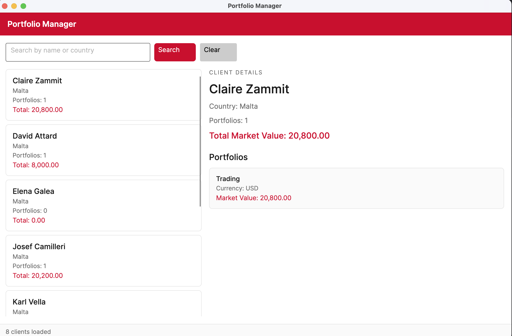
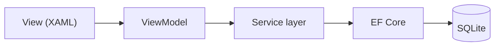
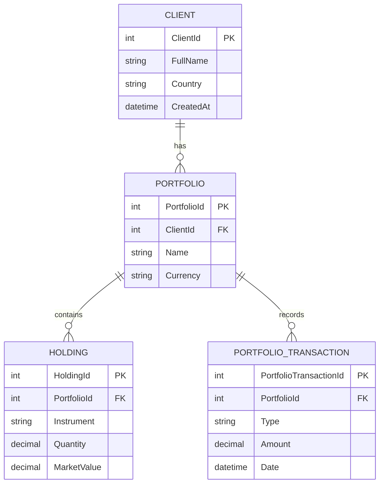

# Portfolio Manager

A desktop application for managing clients and their investment portfolios, built with **C#**, **Avalonia UI** and **Entity Framework Core**.

I built this project to study how Avalonia works and to practice building a real desktop application with the **MVVM pattern**, from the database up to the UI. The idea was inspired by the financial services industry — companies that manage clients, their portfolios, holdings and transactions — and by the kind of internal tool a finance or administration team would use to answer questions like:

- Who is the client?
- Which portfolios do they have?
- What assets are inside each portfolio?
- What is the total market value?
- Which transactions happened?

## Screenshots



## Features

- Client list with portfolio count and total market value per client
- Search clients by name or country
- Client details view: portfolios, holdings and transaction history
- SQLite database created and seeded automatically on first run (EF Core migrations)

## Architecture

The application follows a layered architecture with MVVM on top:



**Why MVVM?** The View only contains layout and bindings, the ViewModel holds the UI state and commands, and the Service layer talks to the database. This separation means:

- The ViewModel never touches EF Core directly — it calls `IClientPortfolioService` and receives **DTOs**, so the UI is not coupled to the database model.
- The View has no logic — everything it shows comes from data binding, which makes the UI easy to change without breaking behaviour.
- Each layer can be understood (and later tested) on its own.

I deliberately kept it simple: no repositories and no web API at this stage. EF Core already works as the data access abstraction, so a small service layer for the application use cases was enough. If the project grows, the same service layer could sit behind an ASP.NET Core API without changing the ViewModels' point of view.

### Database

The schema is managed with **EF Core migrations** (`InitialCreate`), and the demo data is seeded through a dedicated migration (`SeedDemoData`) using `HasData` — so schema and sample data are versioned together and the database can always be rebuilt from scratch. The app applies pending migrations on startup, so no manual setup is needed.

## Data model



## Tech stack

| Layer | Technology |
|-------|------------|
| UI | Avalonia 12 (Fluent theme) |
| MVVM | CommunityToolkit.Mvvm (source generators for observable properties and commands) |
| Data access | Entity Framework Core 10 |
| Database | SQLite |
| Language / runtime | C# / .NET 10 |

## Getting started

```bash
git clone https://github.com/DeVFirmino/AvaloniaPortifolioManager
cd AvaloniaPortifolioManager
dotnet run
```

That's it — on first run the app creates the SQLite database, applies all migrations and seeds the demo data.

## Project structure

```text
Models/         Domain entities (Client, Portfolio, Holdings, PortfolioTransaction)
Data/           AppDbContext (Fluent API mappings, seed data) and design-time factory
Migrations/     EF Core migrations (schema + demo data)
Dtos/           Records returned by the service layer to the UI
Services/       IClientPortfolioService and its EF Core implementation
ViewModels/     MainViewModel (UI state, commands)
Views/          MainWindow (XAML layout and bindings)
```

## What I learned

- How Avalonia applications are structured: `App.axaml`, window lifetimes, compiled bindings and `DataTemplate`s
- MVVM in practice with CommunityToolkit.Mvvm: `[ObservableProperty]`, `[RelayCommand]` and property change callbacks
- EF Core end to end: entity mapping with Fluent API, migrations, seeding data with `HasData`, and why the DbContext should receive its options from outside
- Why DTOs between the service and the UI keep the ViewModel independent from the database model

## A note on how this was built

The idea, direction and decisions in this project are mine. I used an LLM as a learning and training tool along the way — to explain concepts, review my steps and help build some parts of the project under my guidance. Every layer was built incrementally, and I made a point of understanding each piece before moving to the next one, which is reflected in the commit history.

## Next steps

- Create transactions from the UI (`CreateTransactionAsync`)
- Dependency injection container instead of manual wiring in `App.axaml.cs`
- Unit tests for the service layer
- Support for SQL Server as an alternative provider
